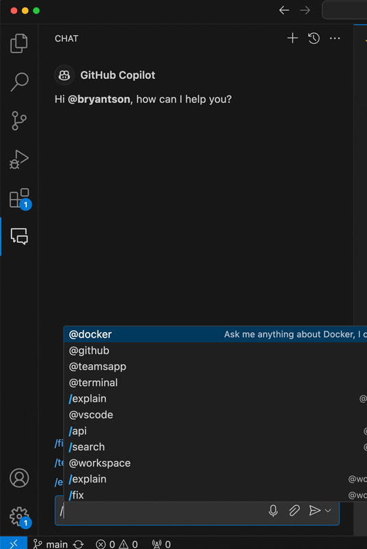
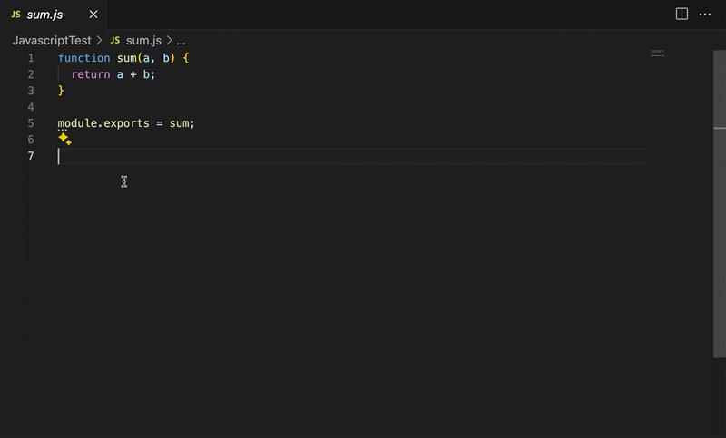

# Exercise 1: Starting with unit testing with Javascript through GitHub Copilot

This exercise should be the first one demonstrating how to leverage GitHub Copilot to speed up the development process of a Javascript testing frameworks like Jest, and also discover new ways to write tests.

In this directory `Exercise1`, you will find the following files:
- [`sum.js`](sum.js): A simple Javascript file that contains a function that adds two numbers.

Open the `sum.js` file through **Visual Studio Code** and follow the instructions to complete the exercise.

### Step 1: Ask GitHub Copilot Chat to ask how to write unit tests

We have a file `sum.js` that contains a simple function that adds two numbers. Let's say we want to start by asking GitHub Copilot to help us write a unit test for this function.

Open up **GitHub Copilot Chat** panel and ask a question like this:

`How to start creating unit tests for my sum.js?`


Of course, this is not the only way to ask GitHub Copilot to write a unit test, but this is really a quick way to start for sure. Now, GitHub Copilot is super generative, and your response can vary depending on the context of your project, when you ask, and how you ask. And there are different unit testing frameworks like Jest, Mocha, Jasmine, etc. that you can use to write unit tests. In the sample animating screenshot above, GitHub Copilot is suggesting one with Jest. That is maybe or maybe not what you want. You can always ask GitHub Copilot to write a unit test with a different testing framework. For example, you can ask like this:

`How to start creating unit tests for my sum.js with Mocha?`


This is excellent, but there is an unique functionality built-in with GitHub Copilot that you can leverage to generate unit tests, and that is called **slash** command. You can always use the **slash** command to generate unit tests. For example, you can type `/tests` in the chat and GitHub Copilot will generate a unit test for you.



What is the difference between this way versus the prior way? The difference is that the slash command is a quick way to generate unit tests without asking a question. But it can also increase the likelihood of generating a unit test that is more accurate, and the context is set to be the unit testing.

Just because GitHub Copilot is suggesting something, it is neither a good idea that you can take for granted without a further human review nor it is the best answer. Always look through own judgement and evaluation steps to make sure that the code is correct and meets the requirements.

### Step 2: Creating unit tests without asking GitHub Copilot Chat

But let's say you want to write a unit test without asking GitHub Copilot Chat. You can always write a unit test by yourself. And one way to do is just to start with a test file. Create a new file called `sum.test.js` in the same directory where `sum.js` is located. And write a test like this:

```javascript
// // Test file for sum.js
```
And enter **Tab** key to trigger GitHub Copilot to generate a test for you. Of course, you don't have to stick to the comment like that. Just make sure you write enough context so GitHub Copilot can **guess** what you want to write.


If you keep entering **Tab** key, GitHub Copilot will likely generate different unit test cases based on the pattern. And you can always modify the generated tests to meet your requirements.

### Step 3: Generate unit tests through GitHub Copilot Suggestion panels

Another way to generate unit tests is to use the GitHub Copilot suggestion panels. You can always look at the suggestions that GitHub Copilot is providing and select the one that you think is the best. You can always select the suggestion and press **Enter** key to accept the suggestion.

To start, write a comment like this:

```javascript
// // Test file for sum.js
```

Then, hold the **Ctrl** key and press **Space** key to open up the suggestion panel. You can see the suggestions that GitHub Copilot is providing. You can select the one that you think is the best by clicking the **Accept** button.


### Step 4: Evaluation through in-file Copilot suggestion feature

Last way to generate unit tests is to use the in-file Copilot suggestion feature. This way does require **Copilot Chat** to be enabled. Open your `sum.js`, highlight the code lines, then right click to find **Copilot** option. From that, select **Generate tests** option.



This is very similar to the one you generated unit tests through **Step 1** earlier through **Slash** command. But this is more context-aware and you can generate unit tests based on the code you have written.

That is it! In the next section, we will focus on a specific framework to actually try out the unit tests.

[> Move to Exercise 2: Trying out unit tests in Javascript with Jest through GitHub Copilot](../Exercise2/README.md)