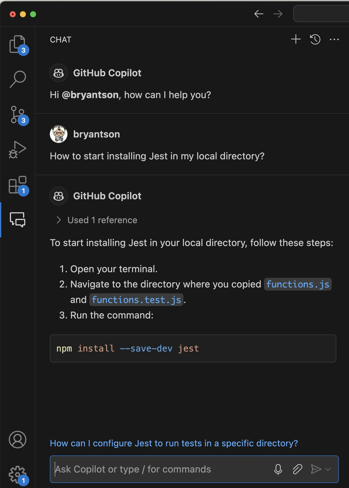
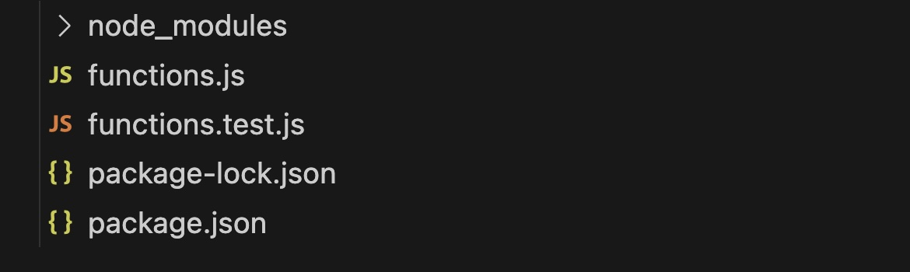
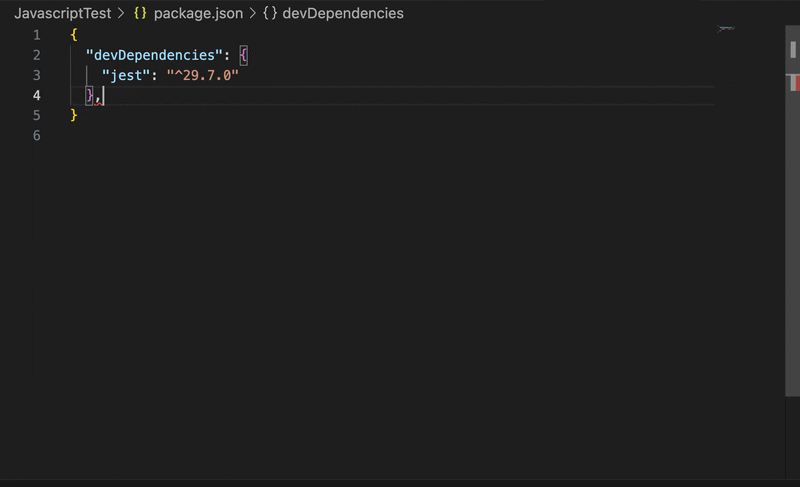
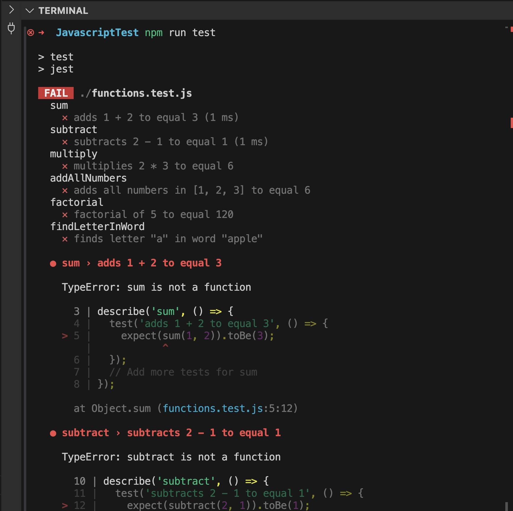
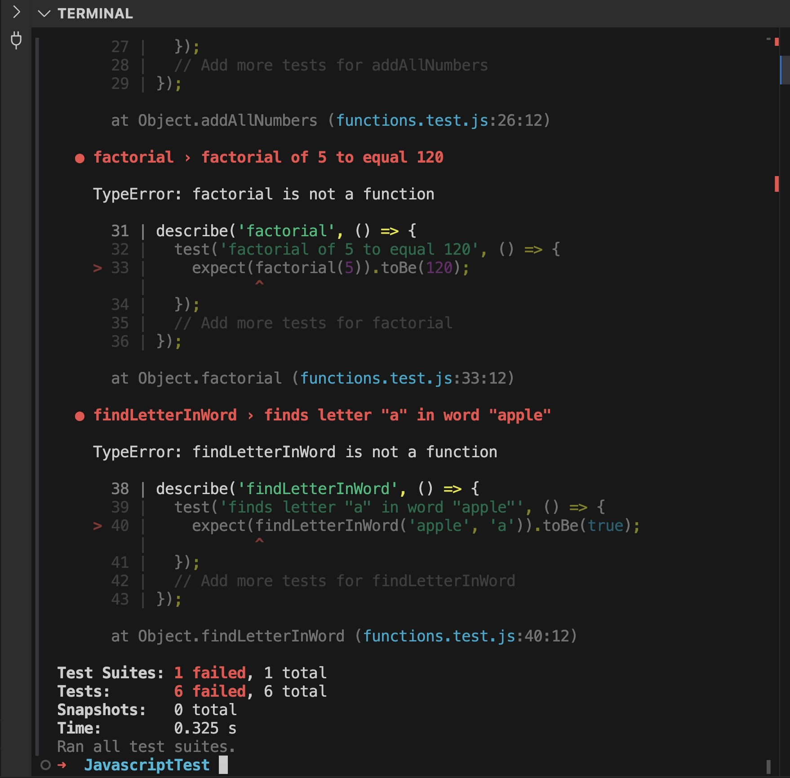

# Exercise 2: Trying out unit tests in Javascript with Jest through GitHub Copilot

In this time, we will focus on trying out unit tests in Javascript with Jest through GitHub Copilot. This directory includes two files: 

- [`functions.js`](./functions.js): A Javascript source code that contains different utility functions where we put those functions Jest test cases.
- [`functions.test.js`](./functions.test.js): A Jest test file that contains test cases for the functions in `functions.js`.

`functions.js` purposely contains few functions that are faulty, and it is your job to leverage GitHub Copilot to identify those faulty functions and correct test cases for them. Without further ado, let's get started.

## Step 1: Install Jest through NPM (or Yarn)

Make sure to copy the `functions.js` and `functions.test.js` files to your local machine into a same directory. Then, open up the terminal and run the following command to install Jest through NPM:

```bash
npm install --save-dev jest
```

You can of course ask GitHub **Copilot Chat** to help you install Jest through NPM. Just ask a question like this: `How to start installing Jest in my local directory?`



You will have few files and directories created in your local directory after running the command. You can see the `node_modules` directory and `package.json` file created.



That is it! We are now ready to move into our next step.

## Step 3: Run Jest test cases, figure out failures, then fix them!

We are ready to run our sample test cases (which are faulty). But before doing that, we need to modify the `package.json` file to include the test script. Open up the `package.json` file and modify the `scripts`. If you have Copilot enabled, it should automatically add the `scripts` section like this.



Now, we are ready to run the test cases. Open up the terminal and run the following command:

```bash
npm run test
```

You should see an error message like this:





