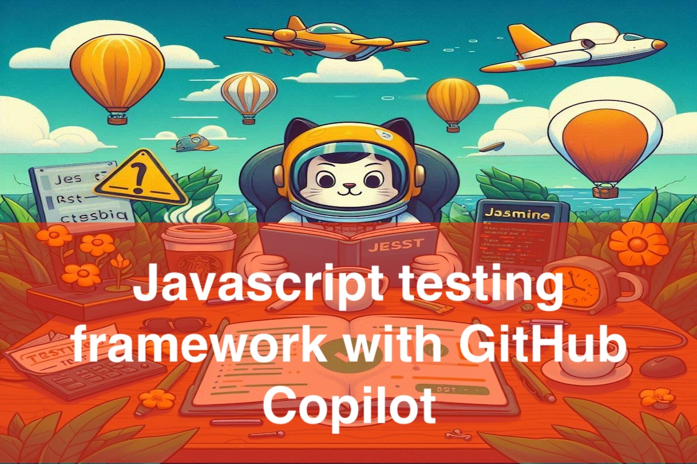

# Copilot Javascript Unit Testing Demo Workshop and examples
<!-- REPLACE THE TITLE WITH THE NAME OF THE EXERCISE -->

This repository contains a collection of Javascript unit testing exercises that demonstrate the capabilities of Copilot. Each exercise is designed to be a standalone example that showcases a specific feature or concept.

## 🎯 Goal
<!-- ONE SENTENCE ABOUT THE GOAL OF THE EXERCISE -->

User should be able to leverage GitHub Copilot to speed up the development process of a Javascript testing frameworks like Jest, and also discover new ways to write tests.

## ✍️ Programming Languages
<!-- BULLETED LIST OF LANGUAGES INVOLVES -->

- Javascript
- NPM
- Javascript testing frameworks like Jasmine, Jest, and MochaJS

## 💻 IDE
<!-- OPTIONALLY SPECIFY THE IDEs THAT SHOULD BE USED -->
- Visual Studio Code

## 🗒️ Guide
<!-- STEP BY STEP INSTRUCTIONS DETAILING HOW TO COMPLETE THE EXERCISE -->

- [Exercise 1: Starting with unit testing with Javascript through GitHub Copilot](./Exercises/Exercise1/README.md)
- [Exercise 2: Trying out unit tests in Javascript with Jest through GitHub Copilot](./Exercises/Exercise2/README.md)

## 🤝 Contributing
Contributions are warmly welcomed! ✨

To contribute to a public exercise, please refer to our contribution guidelines [here](https://github.com/ps-copilot-sandbox/.github/blob/main/.github/CONTRIBUTING.md).

To create a net new exercise, please use [this repository template](https://github.com/ps-copilot-sandbox/copilot-exercise-template).
